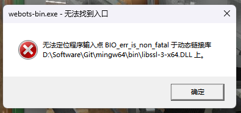

# Webots学习笔记

## 前期使用

1. Webots 需要独立显卡，没有独显可能会运行卡顿或无法运行。

2. 为什么我的Webots打开总是报错呢？



你的 Webots 报错提示中提到了 `BlO err is non fatal` 和 `Vlibss1-3-x64.DLL`，这通常表示动态链接库（DLL）文件之间存在兼容性问题，尤其是 Webots 可能在加载其他软件（如 Git）中的某些 DLL 文件时出现了冲突。以下是一些常见的解决方案，可以帮助你排查和解决问题：

### 1. **检查 DLL 文件路径冲突**
- 错误信息中的路径 `D:\Software\Git\mingw64\bin` 表示 Webots 可能在启动时尝试加载 Git 的某些 DLL 文件，而这些文件与 Webots 所需要的 DLL 文件版本不兼容。
- 解决方案：尝试将 Git 的 `mingw64\bin` 路径从系统环境变量 `PATH` 中临时移除，重新启动 Webots 看看问题是否依然存在。
    1. 右键点击“此电脑” -> “属性” -> “高级系统设置” -> “环境变量”。
    2. 在“系统变量”中找到 `Path` 变量并编辑。
    3. 将 `D:\Software\Git\mingw64\bin` 的路径临时删除或者移动到最后。
    4. 保存设置并重新启动 Webots。

### 2. **确认 Webots 与 Git 的版本兼容性**
- 某些 Webots 版本与特定版本的 Git 存在兼容性问题，尤其是使用 `mingw` 编译的 DLL 文件时。
- 解决方案：
    1. 尝试升级或降级 Git 的版本，例如使用 Git 2.x 系列的稳定版本。
    2. 检查 Webots 官网是否有最新的补丁更新，修复了 DLL 文件冲突问题。

### 3. **为 Webots 设置独立的启动环境**
- 可以考虑为 Webots 创建一个独立的启动脚本，在启动脚本中屏蔽掉与 Git 相关的路径。
- 解决方案：
    1. 创建一个新的批处理文件（例如 `launch_webots.bat`）。
    2. 在文件中添加如下内容：
    ```batch
    @echo off
    set PATH=D:\Webots\bin;%PATH%
    start D:\Webots\webots-bin.exe
    ```
    3. 保存后，通过该批处理文件启动 Webots，确保 Webots 使用的 `PATH` 环境变量优先包含 Webots 的路径。

### 4. **检查 Webots 的启动配置文件**
- Webots 启动时可能加载了不必要的 DLL 文件，可以检查 Webots 的启动配置文件（例如 `webots.ini`）或者使用 `ldd` 工具（Linux 环境）查看 Webots 依赖的所有 DLL 文件，手动排查冲突的文件。

### 5. **重新安装或修复 Webots 和 Git**
- 如果以上方法无效，可以尝试重新安装 Webots 和 Git，并确保在安装时的环境变量配置没有冲突。
- 先卸载 Webots 和 Git，然后安装 Webots，最后安装 Git，确保 Git 的 `mingw64` 路径不会影响 Webots 的启动。

### 6. **使用依赖检查工具**
- 在 Windows 上，可以使用 `Dependency Walker` 工具来分析 `webots-bin.exe` 所需的所有 DLL 文件，查看是否有任何 DLL 文件缺失或者版本冲突。

### 7. **查阅 Webots 官方文档或论坛**
- Webots 官方文档和论坛可能已经有关于此问题的解决方案，可以前往查阅：
    - [Webots 官方文档](https://cyberbotics.com/doc/guide/installation-procedure)
    - [Webots 官方论坛](https://forum.cyberbotics.com/)

尝试上述步骤后，如果问题依然存在，可以提供更多的错误日志或详细信息（例如 Webots 的启动日志），我可以进一步帮助你分析问题。

## Webots使用

* printf需要加入换行符
如果你在Webots的`Console`窗口中使用`printf`语句时没有看到任何输出，可能是由于以下几个常见原因导致的。接下来，我将逐一介绍这些原因，并给出相应的解决方案：

### 1. **未刷新输出缓冲区：**
在C语言中，`printf` 函数的输出是缓冲的，这意味着输出的内容不会立即显示在控制台上，除非满足以下条件之一：
- 输出中包含换行符 `\n`（如：`printf("Robot Pitch: %f radians.\n", pitch);`）。
- 调用 `fflush(stdout);` 来强制刷新标准输出缓冲区。

**解决方案：**
- 确保每个 `printf` 语句都包含换行符 `\n`，或者在 `printf` 语句后面加上 `fflush(stdout);`。
  
**示例：**
```c
// 加入换行符来刷新缓冲区
printf("Robot Pitch: %f radians.\n", pitch);
printf("Motor Speed: %f rad/s\n", speed);

// 或者使用 fflush 函数强制刷新输出
printf("Robot Pitch: %f radians.", pitch);
fflush(stdout);
```


* 我不明白！！！！！


